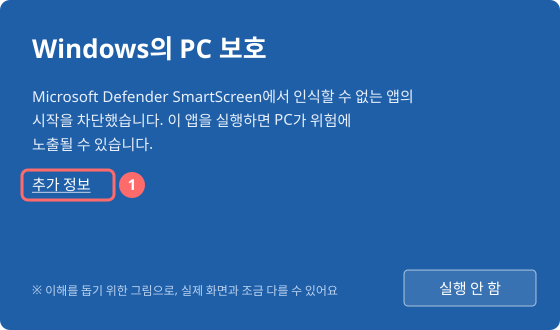
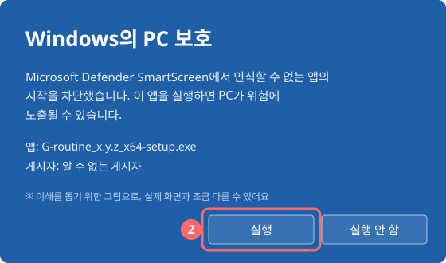
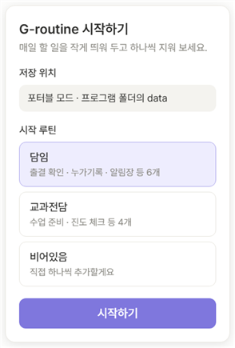
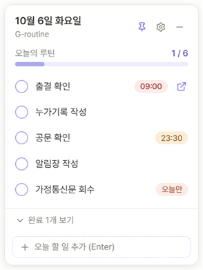
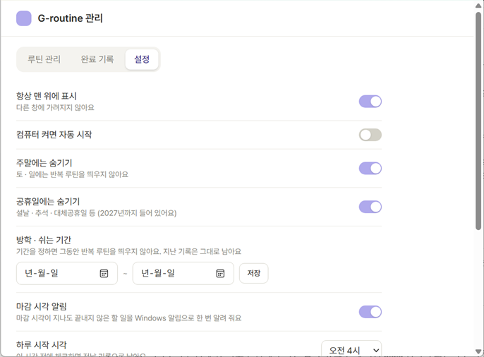

# G-routine 설치 안내

교사용 매일 루틴 위젯 G-routine을 학교 PC에 설치하는 방법이에요. 5분이면 끝나요.

## 1. 내려받기

[최신 릴리스 페이지](https://github.com/limhs06082-eng/g-routine/releases/latest)에서 파일 하나를 받으세요.

| 파일 | 이럴 때 |
|---|---|
| **`G-routine_<버전>_x64-setup.exe`** (추천) | 보통은 이 파일이에요. 새 버전이 나오면 **자동으로 업데이트**돼요 |
| `G-routine_<버전>_portable.zip` | 설치 없이 USB나 D드라이브에 두고 쓰고 싶을 때. 자동 업데이트는 되지 않아요 |

## 2. "Windows의 PC 보호" 창이 뜨면

G-routine은 개인이 만든 프로그램이라 아직 Microsoft 인증(코드 서명)이 없어요. 그래서 처음 실행할 때 아래와 같은 파란 창이 뜰 수 있어요.

**① 추가 정보**를 누르고

**② 실행**을 누르세요.

> 안심하고 실행하려면 파일을 꼭 **위 릴리스 페이지(github.com/limhs06082-eng/g-routine)** 에서 받으세요. 다른 곳에서 받은 파일이라면 실행하지 마세요.

설치는 **관리자 권한 없이** 내 사용자 폴더에 돼요. 설치 마지막 화면에서 실행을 체크한 채 마침을 누르면 바탕화면 오른쪽 아래에 G-routine이 나타나요. 체크를 풀었다면 시작 메뉴에서 G-routine을 누르세요.

## 3. 처음 실행하기

*그림은 포터블 버전 화면이에요. 설치 버전에서는 저장 위치 옆의 폴더 버튼으로 폴더를 고를 수 있어요.*

1. **저장 위치**: 루틴과 체크 기록을 둘 폴더를 골라요. 고른 폴더 안에 `G-routine\data` 폴더가 만들어져요.
   - 복원 프로그램이 있는 PC는 꼭 **D드라이브**를 고르세요 (아래 4번 참고).
   - 이미 G-routine 데이터가 있는 폴더를 고르면 그 데이터를 그대로 불러와요.
2. **시작 루틴**: `담임` / `교과전담` / `비어있음` 중에 골라요. 나중에 얼마든지 바꿀 수 있어요.
3. **시작하기**를 누르면 끝!

포터블 버전은 위 그림처럼 "포터블 모드"로 표시되고, 프로그램 옆 `data` 폴더에 저장돼요.

## 4. 복원 프로그램이 있는 학교 PC

재부팅하면 C드라이브가 초기화되는 PC라면 이 순서를 지켜 주세요.

1. 복원 프로그램을 **해제한 상태**에서 설치하고 한 번 실행해요. (자동 시작 등록과 새 버전이 유지돼요)
2. 저장 위치는 **D드라이브**(예: `D:\G-routine\data`)로 골라요.
3. 복원을 다시 켜요. 루틴과 체크 기록은 D드라이브에 남아요. 혹시 설정이 지워져도 G-routine이 D드라이브의 데이터를 **자동으로 다시 찾아요.**

> 복원이 켜진 상태에서 업데이트가 설치되면, 재부팅할 때 예전 버전으로 돌아갔다가 켜질 때 다시 업데이트돼요. 새 버전을 고정하려면 복원 해제 상태에서 한 번 켜 두세요.

## 5. 이렇게 써요

- 동그라미를 누르면 **완료** — 3초 안에 "되돌리기"를 누르면 취소돼요
- **↗** 버튼: 루틴에 연결해 둔 사이트나 프로그램(NEIS 등)을 열어요
- **마감 시각**이 지나도 끝내지 않은 일은 칩이 **붉게** 바뀌고, Windows 알림으로 한 번 알려 줘요
- 아래 입력란: 오늘만 할 일을 바로 적어요 (Enter)
- **Ctrl+Alt+G**: 위젯을 숨기고, 한 번 더 누르면 다시 보여요 — TV · 프로젝터로 화면을 띄울 때 편해요
- **⤡ 작게 보기**: 위젯을 알약 모양(✓ 3/7)으로 줄여요. 알약을 누르면 다시 커져요
- 루틴마다 **시간대**(조회 전 · 수업 중 · 방과 후)를 정하면 위젯에서 시간대별로 묶여 보여요
- **⚙**: 관리 창 — 루틴 추가 · 수정 · 순서 바꾸기, 날짜별 완료 기록, 설정

## 6. 설정

- **공휴일에는 숨기기**: 설날 · 추석 · 대체공휴일 같은 공휴일에는 반복 루틴을 띄우지 않아요. 임시공휴일이나 새 해의 공휴일은 인터넷으로 자동으로 받아요
- **방학 · 쉬는 기간**: 시작일과 끝나는 날을 정하면 그동안 반복 루틴을 쉬어요 (지난 기록은 그대로)
- **마감 시각 알림**: 마감이 지난 할 일을 Windows 알림으로 알려 줄지 정해요
- 그 밖에 항상 맨 위에 표시 · 자동 시작 · 주말 숨기기 · 하루 시작 시각 · 테마색 · 백업

## 7. 문제가 생기면

| 증상 | 해결 |
|---|---|
| 위젯이 안 보여요 | 작업표시줄 오른쪽 트레이의 G-routine 아이콘을 누르세요. 그래도 안 보이면 아이콘 메뉴의 **위치 초기화** |
| 알림이 안 떠요 | 설정 탭의 **마감 시각 알림**이 켜져 있는지, Windows 설정 > 시스템 > 알림에서 G-routine이 켜져 있는지, 방해 금지(집중 모드)가 꺼져 있는지 확인하세요. 놓친 알림은 작업표시줄 오른쪽 끝의 알림 센터에 남아요 |
| "저장 폴더를 찾지 못했어요"가 떠요 | D드라이브가 연결되어 있는지 확인하고, 예전 폴더를 다시 골라 주세요 |
| "데이터 파일이 손상된 것 같아요"가 떠요 | **최근 백업으로 복구**를 누르세요. 매일 자동 백업이 7일치 보관돼 있어요 |
| 지우고 싶어요 | **설치 버전**: Windows 설정 > 앱 > 설치된 앱 > G-routine > 제거. 저장 폴더(`G-routine\data`)는 남으니 필요 없으면 직접 지우세요. **포터블 버전**: 설정에서 **자동 시작**을 끈 뒤 zip을 푼 프로그램 폴더를 통째로 지우세요 (기록이 든 `data` 폴더도 그 안에 있으니, 남기려면 먼저 옮겨 두세요) |
